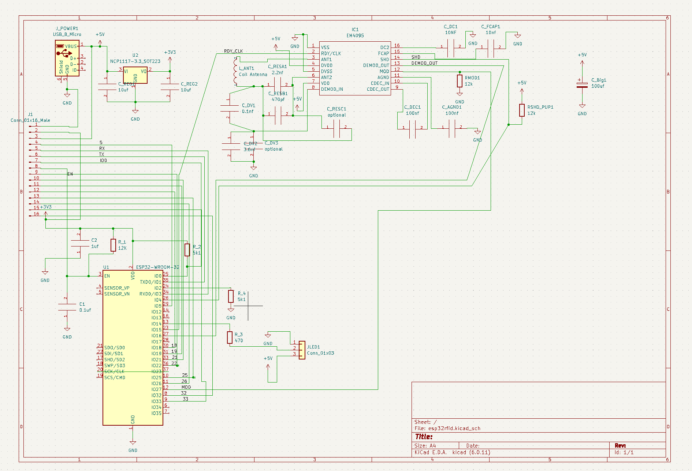
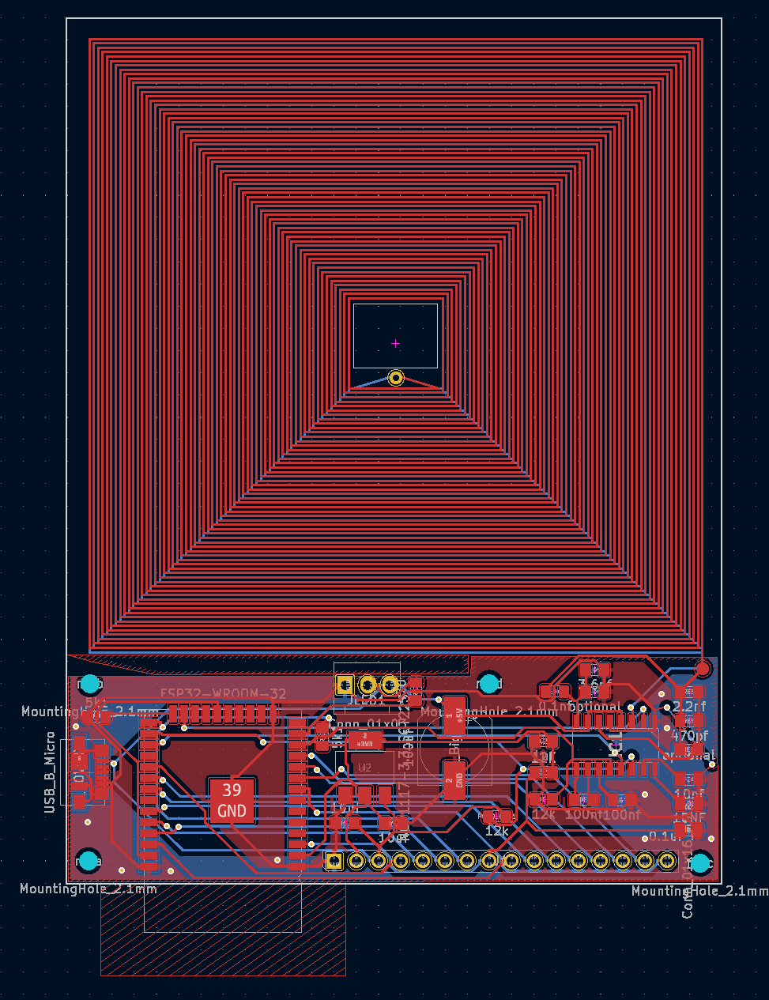
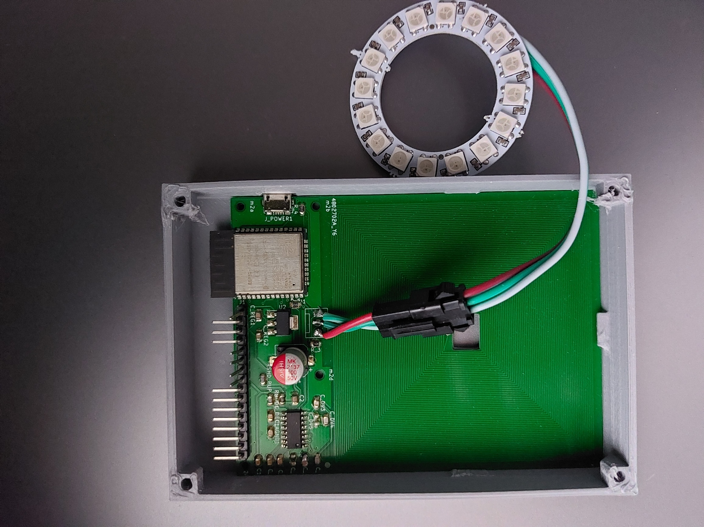

### ESP32 rfid circuit 
## 125khz rfid reader/writer for EM4x chips
### Works for kyber crystals
## Firmware
https://github.com/nykloo/ESP32RFID-Firmware
## Control App
https://github.com/nykloo/ESP32RFID-App
## IMPORTANT NOTES
+ C_RESA1, C_RESB1,C_DV1, C_DV2 should be fairly close to their intended values (ie use capicitors with a tolerance of less than 5%) Alternatively the optional capacitors can be used to more  tune the resonate frequency of the antenna circuit. 
+ The PCB coil antenna is designed to printed on a pcb with thickness of 1mm and outer copper weight of 1 oz. I have been ordering these from jlc pcb.

## Schematic

## PCB

## Assembly

